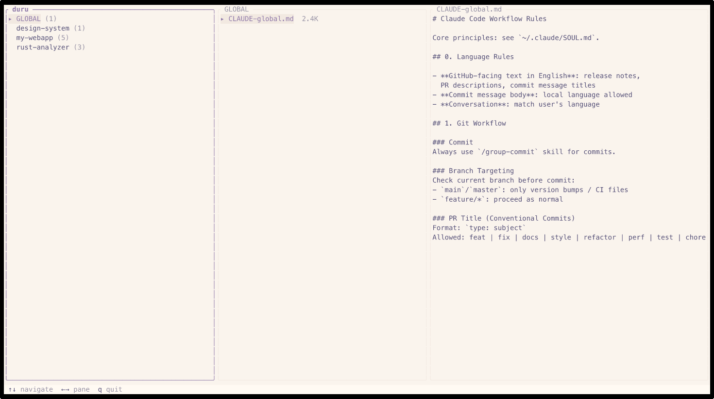

<p align="center">
  
</p>

# duru (두루)

Terminal dashboard for Claude Code — explore, manage, and monitor your setup.

> **두루** (Korean): thoroughly, comprehensively, all around — named after 두루미, the Korean crane

duru scans `~/.claude/` and displays all your CLAUDE.md files and auto-memory across every project in a Miller Columns TUI.

<p align="center">
  
</p>

## Install

### Homebrew (macOS / Linux)

```bash
brew install uppinote20/tap/duru
```

### Scoop (Windows)

```powershell
scoop bucket add uppinote20 https://github.com/uppinote20/scoop-bucket
scoop install duru
```

### Install script (macOS / Linux)

```bash
curl --proto '=https' --tlsv1.2 -sSf https://raw.githubusercontent.com/uppinote20/duru/main/install.sh | bash
```

### From source

```bash
cargo install --path .
```

### Prebuilt binaries

Download from [Releases](https://github.com/uppinote20/duru/releases) for macOS (ARM/x86_64), Linux (GNU/musl), and Windows (x86_64/ARM64).

## Usage

```bash
duru                    # launch TUI
duru --theme light      # force light theme
duru --path ~/alt/.claude  # custom path
```

### Modes

Press `Tab` to switch between two modes:

- **Memory** (default) — Browse `CLAUDE.md` and memory files across all projects
- **Sessions** — Live table of active Claude Code sessions with cache TTL countdowns

### Memory mode keys

| Key | Action |
|-----|--------|
| `↑↓` / `jk` | Navigate within pane |
| `←→` / `hl` | Switch pane |
| `Enter` | Enter next pane |
| `e` | Edit selected file in `$EDITOR` |
| `Tab` | Switch to Sessions mode |
| `q` | Quit |

### Sessions mode keys

| Key | Action |
|-----|--------|
| `jk` / `↑↓` | Navigate rows (Table) / scroll (Detail) |
| `hl` / `←→` | Toggle Table / Detail focus |
| `s` | Cycle sort (activity → TTL → project → size) |
| `r` | Force refresh |
| `g` `G` | Jump to top / bottom |
| `Tab` | Switch to Memory mode |
| `q` | Quit |

## Layout

**Memory mode** uses Miller Columns (3-pane):

- **Pane 1** — All projects that have CLAUDE.md or memory files
- **Pane 2** — Files in the selected project (CLAUDE.md, MEMORY.md, etc.)
- **Pane 3** — File content preview

**Sessions mode** uses a Table + Detail layout:

- **Table** — 6 columns: state glyph, short ID, project, last activity, cache TTL, size
- **Detail** — Fixed 8-row panel showing full session metadata

Cache TTL is shown as a hybrid `mm:ss ████▌·····` bar with color thresholds (green > 50%, yellow 20–50%, red < 20%).

### State glyph

Two-state, aligned with Anthropic's 5-minute prompt-cache TTL:

- `●` warm — last write within 5 min (cache likely still live on the server)
- `○` cold — last write older than 5 min (cache expired; resuming pays a miss)

duru cannot tell from disk alone whether a session's Claude Code process is still running. `/clear`, `/exit`, or a killed terminal leave the transcript file on disk and duru classifies it only by mtime.

## Theme

Rosé Pine with automatic dark/light detection.

## License

MIT OR Apache-2.0
